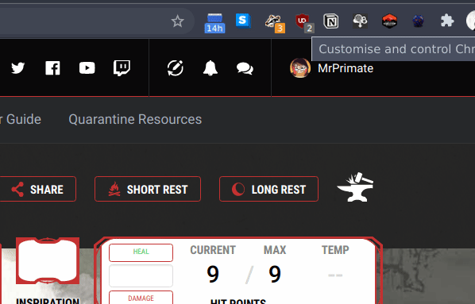
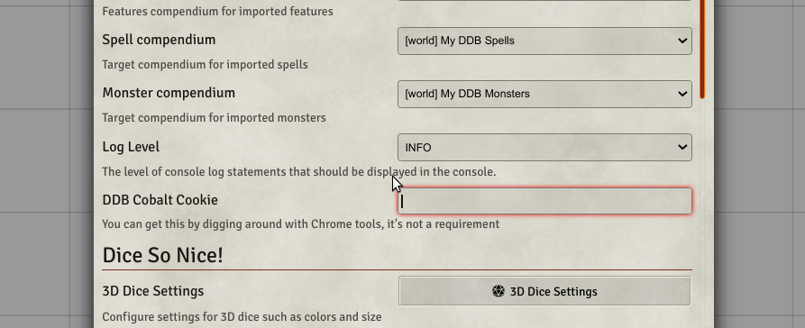

# DDB-Importer Chrome Extension

This is a helper extension for [MrPrimate's DDB-Importer](https://github.com/mrprimate/ddb-importer).

Right now it helps you extract the dndbeyond.com Cobalt Session token to use for authentication against their api endpoints.

## Install

Download the latest release zip from the [release page](https://github.com/MrPrimate/ddb-importer-chrome/releases).

1. Unzip the release
2. Go to Chrome Extensions page (Menu->More Tools->Extensions)
3. Enable Developer Mode (Top-right corner)
4. Click on the 'Load Unpacked' button
5. Select the Directory where you extracted this extension

## Usage

